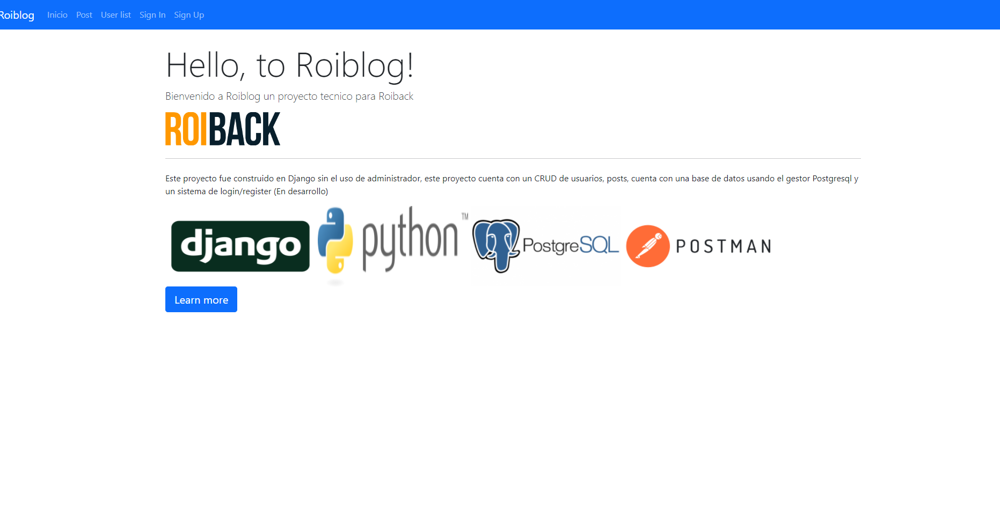
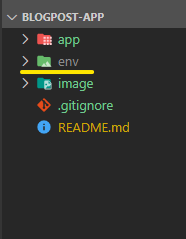
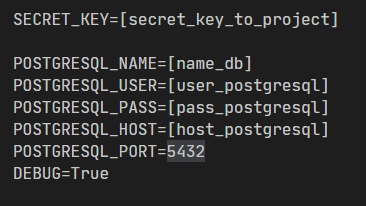

<!--
*** Thanks for checking out the Best-README-Template. If you have a suggestion
*** that would make this better, please fork the repo and create a pull request
*** or simply open an issue with the tag "enhancement".
*** Thanks again! Now go create something AMAZING! :D
***
***
***
*** To avoid retyping too much info. Do a search and replace for the following:
*** github_username, repo_name, twitter_handle, email, project_title, project_description
-->


<!-- PROJECT SHIELDS -->
<!--
*** I'm using markdown "reference style" links for readability.
*** Reference links are enclosed in brackets [ ] instead of parentheses ( ).
*** See the bottom of this document for the declaration of the reference variables
*** for contributors-url, forks-url, etc. This is an optional, concise syntax you may use.
*** https://www.markdownguide.org/basic-syntax/#reference-style-links
-->
<!-- [![Contributors][contributors-shield]][contributors-url]
[![Forks][forks-shield]][forks-url]
[![Stargazers][stars-shield]][stars-url]
[![Issues][issues-shield]][issues-url]
[![MIT License][license-shield]][license-url]
[![LinkedIn][linkedin-shield]][linkedin-url] -->


<!-- PROJECT LOGO -->
<br />
<p align="center">
  <a href="https://github.com/github_username/repo_name">
    
  </a>

  <h3 align="center">Roiblog</h3>

  <p align="center">
    WebApp creada en Django el cual cuenta con login/register, CRUD para posts
  </p>
</p>


<!-- TABLA DE CONTENIDO -->
<details open="open">
  <summary><h2 style="display: inline-block">Tabla de Contenido</h2></summary>
  <ol>
    <li>
      <a href="#acerca-del-proyecto">Acerca del proyecto</a>
      <ul>
        <li><a href="#construido-con">Construido con</a></li>
      </ul>
    </li>
    <li>
      <a href="#getting-started">Getting Started</a>
      <ul>
        <li><a href="#prerequisitos">Prerequisitos</a></li>
        <li><a href="#instalacion">Instalacion</a></li>
      </ul>
    </li>
    <li><a href="#usage">Usage</a></li>
    <li><a href="#contactos">Contactos</a></li>
    <li><a href="#agradecimientos">Agradecimientos</a></li>
  </ol>
</details>


<!-- ABOUT THE PROJECT -->
## Acerca del proyecto



Este proyecto fue construido en Django sin el uso de administrador, este proyecto
cuenta con un CRUD de usuarios, posts, cuenta con una base de datos usando el gestor Postgresql
y un sistema de login/register (En desarrollo)


### Construido con

* Django
* Python
* Postgresql
* Bootstrap
* Postman
* Git


<!-- GETTING STARTED -->
## Getting Started

Para iniciar el proyecto primero debe instalar los siguientes requesitos

### Prerequisitos

Para que el proyecto funcione debe tener instalado:
* Postgresql


### Instalacion

1. Clone the repo
   ```sh
   git clone https://github.com/seObando19/BlogPost.git
   ```

2. Crear un entorno virtual en la raiz del proyecto

    
    ```sh
    pip3 install virtualenv
    python -m venv env
    ```

3. Crear archivo .env en la ruta blogpost-app/app/app/ y agregar los siguientes datos

    
* Nota: Al iniciar un proyecto django nuevo la secret_key se encuentra en el archivo settings.py

4. Activar el entorno virtual
    ```sh
    source env/bin/activate
    ```

5. Ubicarse en la carpeta app/ y luego instalar los requerimientos
    ```sh
    cd app/
    pip install -r requirements.txt
    ```

6. Ejecutar la migracion de los modelos a postgresql. estar en la ruta blogpost-app/app/
    ```sh
    python manage.py makemigrations
    python manage.py migrate
    ```

<!-- USAGE EXAMPLES -->
## Usage

Para la ejecucion del proyecto estar en la ruta blogpost-app/app/ y correr el servidor
```sh
python manage.py runserver
```


<!-- CONTACT -->
## Contactos

Email - [sebastiano-10@hotmail.com](mailto:sebastiano-10@hotmail.com)

Twitter - [@seObando19](https://twitter.com/seObando19)

LinkedIn - [sebastianobandop](https://www.linkedin.com/in/sebastianobandop/)

Perfil Github: [seObando19](https://github.com/seObando19)


<!-- ACKNOWLEDGEMENTS -->
## Agradecimientos
Agradezco la oportunidad que se me brindo por parte de Roiback para poder realizar este proyecto donde pude realizar el aprendizaje de diferentes tecnologias y ver en que aspectos debo mejorar.


<!-- MARKDOWN LINKS & IMAGES -->
<!-- https://www.markdownguide.org/basic-syntax/#reference-style-links -->
<!-- [contributors-shield]: https://img.shields.io/github/contributors/seObando19/repo.svg?style=for-the-badge
[contributors-url]: https://github.com/seObando19/repo/graphs/contributors
[forks-shield]: https://img.shields.io/github/forks/seObando19/repo.svg?style=for-the-badge
[forks-url]: https://github.com/seObando19/repo/network/members
[stars-shield]: https://img.shields.io/github/stars/seObando19/repo.svg?style=for-the-badge
[stars-url]: https://github.com/seObando19/repo/stargazers
[issues-shield]: https://img.shields.io/github/issues/seObando19/repo.svg?style=for-the-badge
[issues-url]: https://github.com/seObando19/repo/issues
[license-shield]: https://img.shields.io/github/license/seObando19/repo.svg?style=for-the-badge
[license-url]: https://github.com/seObando19/repo/blob/master/LICENSE.txt
[linkedin-shield]: https://img.shields.io/badge/-LinkedIn-black.svg?style=for-the-badge&logo=linkedin&colorB=555
[linkedin-url]: https://www.linkedin.com/in/sebastianobandop/ -->
